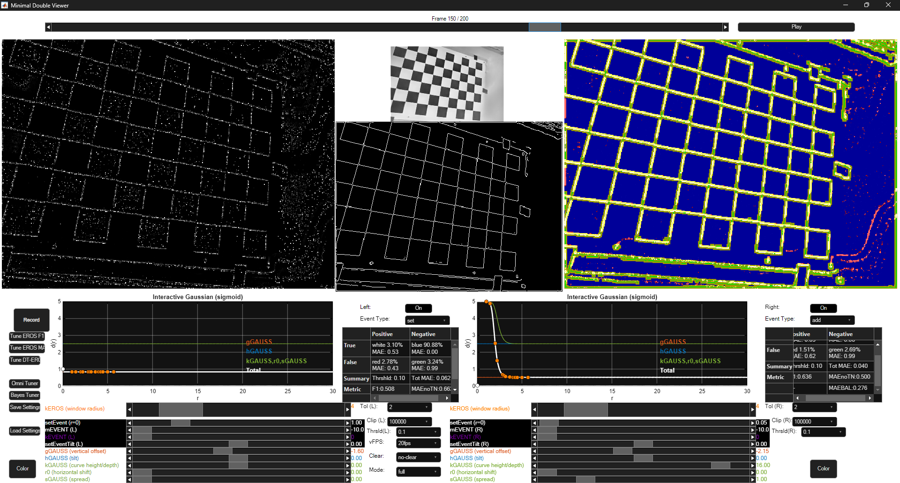
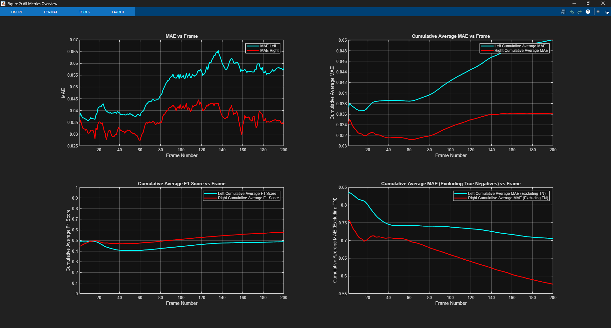

# ANT-EROS GUI

**ANT-EROS GUI Version:** 2026-09-21
**Author:** Peter Kanerva
**Email:** [pkanerva@kth.se](mailto:pkanerva@kth.se)
**MATLAB version tested:** MATLAB R2025a

## How to download

Downloading the repository as a ZIP file is **not recommended**.

The recommended method is to clone the repository using Git:

```bash
git clone https://github.com/tensora/ANT-EROS.git
```

The repository uses **Git LFS (Large File Storage)** for the files in the `01 data` folder. The LFS files should be downloaded automatically when cloning the repository.

If the files in `01 data` are missing after cloning, make sure Git LFS is installed and run:

```bash
git lfs version
git lfs install
cd ANT-EROS
git lfs pull
```


## About

This repository contains the code for the ANT-EROS GUI used to evaluate, tune, and record the EROS algorithm and its extensions.

The GUI provides functionality for:

* Playing and inspecting event data
* Comparing ANT-EROS outputs with Canny edge representations
* Tuning EROS and ANT-EROS kernel parameters
* Evaluating reconstruction quality using several metrics
* Recording ANT-EROS outputs and evaluation results
* Automatically tuning parameters
* Visualizing the EROS and ANT-EROS kernel functions

## Using the Code

The usage of the Matlab code needs a Matlab licence. Just download the repository and open the file named START_APP.m and run it in the Matlab environment.
Example data is included in the repository so that everything can be tested directly without external downloads.

The Canny Edge Detector code is contained within a single Python script file. Prepare a folder with png-images in the same folder as the script and run the script.
You will be asked to specify the folder name after running the script.

### E2VID

This project also uses the **E2VID** implementation for event-to-video reconstruction.

The E2VID code and its installation and usage instructions are maintained in the original repository:

**[E2VID – High Speed and High Dynamic Range Video with an Event Camera](https://github.com/uzh-rpg/rpg_e2vid)**

Please follow the installation and usage instructions provided in the original repository when working with E2VID.

---

# GUI User Manual



The GUI provides two independent EROS processing sides, allowing different configurations to be evaluated and compared simultaneously.

## Playback

The loaded frames can be played using the **Play** button. Playback can be paused, and a particular frame can be selected using the slider or arrow buttons.

The GUI calculates the current EROS surface based on the information stored in the previous frame. Consequently, jumping directly between frames can produce a visually inaccurate representation of the EROS surface.

For the most accurate visualization, play the loaded sequence from the beginning.

The initial state of the EROS surface is unknown, so the output during the first frames of a sequence should be interpreted with some caution.

## Frame Images

The GUI uses a dual-view layout. The EROS output can therefore be configured independently on the left and right sides.

* **Left image:** EROS output using the left-side settings
* **Right image:** EROS output using the right-side settings
* **Upper middle image:** Loaded RGB image
* **Lower middle image:** Corresponding Canny edge representation

The EROS output is displayed as a grayscale image. Neither EROS nor ANT-EROS distinguishes between positive and negative events in the displayed surface.

The Canny edge representation is used as the reference when evaluating the EROS outputs.

## Record

The **Record** button on the left side saves:

* EROS output image sequences
* Slider settings
* Evaluation metrics for the loaded data

## Interactive Gaussian

The **Interactive Gaussian (sigmoid)** window visualizes the kernel currently being used.

The main kernel is based on a normal distribution combined with a linear function and embedded within a sigmoid function. This provides smooth upper and lower limits and allows the kernel shape to be adjusted using the GUI parameters.

The graph shows:

* **x-axis:** Distance from the center of the kernel
* **y-axis:** Kernel intensity
* **White line:** Continuous representation of the kernel
* **Orange dots:** Discrete kernel values actually used by the implementation
* **White dot:** Value of the incoming event

The orange dots represent unique distances from the kernel center rather than every individual kernel pixel.

A second kernel can also be added to the EROS kernel. When enabled, this is represented by a second white line and purple dots. The additional kernel modifies the EROS surface around incoming events.

The secondary additive kernel is less flexible than the main EROS kernel and is controlled using a linear function. This functionality has been removed from the newest version because it substantially increases the parameter-search complexity without improving performance.

## On/Off

The **On/Off** button below the Canny image disables EROS calculation for the selected side.

This can be used to reduce CPU load when only one side of the GUI is required.

## Event Type

The **Event Type** drop-down controls how incoming events are applied to the EROS surface.

Events can either:

* Be directly set on the EROS surface
* Be mathematically added to the existing surface

## Tolerance Level

The **Tolerance** setting determines a region around the Canny edges that is excluded from the evaluation.

Available values are:

* 0 pixels
* 1 pixel
* 2 pixels
* 3 pixels

The tolerance region is displayed as a yellow overlay.

This is intended to provide a fairer comparison between Canny edges and event-based edges. Canny edges are generally one pixel wide, whereas event-based edges may have a different thickness.

## Clip Level

The **Clip** setting limits the allowed range of values on the EROS surface.

The available upper clipping limits are:

`1, 2, 4, 8, 16, 32, 64, 128, 1000, 10000, 100000`

The original EROS algorithm primarily uses decay, making a normalized range of 0–1 sufficient for visualization. ANT-EROS can perform both multiplication and addition, so larger internal values can be useful during processing.

## Threshold Level

The **Threshold** setting determines whether an EROS intensity is classified as an event during evaluation.

Available values are:

`0, 0.01, 0.05, 0.1, 0.2, 0.3, 0.4, 0.5, 0.6, 0.7, 0.8, 0.95, 0.99, 1`

A threshold of **0.1 (10%)** is used in this project.

The threshold primarily acts as a visual classification breakpoint rather than being a critical parameter for the underlying calculations.

## Playback Frame Rate

The **vFPS** setting controls the playback frame rate.

The selected value acts as an upper limit. If the CPU cannot perform the EROS calculations quickly enough, playback will run at the maximum rate supported by the hardware.

## Resetting the EROS Surface

The **Clear** drop-down controls how the EROS surface is reset.

* **Clear:** Clears the previous EROS surface and recalculates the current surface when a setting is changed.
* **No-clear:** Leaves the current surface unchanged.
* **Always-clear:** Resets the EROS surface between every calculated frame.

Resetting the surface sets all values to zero, corresponding to a completely black surface.

## EROS Surface Size

The **Mode** drop-down provides two options:

* **full**
* **half**

The **half** mode reduces the surface dimensions by a factor of two in each direction. This results in four times fewer pixels to calculate and can therefore increase playback speed.

## Metrics

The metrics window displays evaluation values for the current frame in real time.

The evaluation compares the binary Canny edge image with the grayscale EROS output.

The following metrics are calculated:

### True Positives

Percentage of true-positive pixels relative to the total number of pixels, excluding the tolerance region.

A corresponding MAE value is also calculated.

### True Negatives

Percentage of true-negative pixels relative to the total number of pixels, excluding the tolerance region.

A corresponding MAE value is also calculated.

### False Positives

Percentage of false-positive pixels relative to the total number of pixels, excluding the tolerance region.

A corresponding MAE value is also calculated.

### False Negatives

Percentage of false-negative pixels relative to the total number of pixels, excluding the tolerance region.

A corresponding MAE value is also calculated.

### Threshold

The threshold used to determine whether an EROS intensity is classified as an event.

The threshold is normalized between 0 and 1.

### Total MAE

Mean Absolute Error calculated over all pixels in the frame, excluding the tolerance region.

### F1 Score

F1 score calculated for the current frame, ranging from 0 to 1.

### MAE without TN

Mean Absolute Error calculated while excluding both the true-negative region and the tolerance region.

This metric is useful because event datasets are typically sparse, meaning that large areas contain no events. Without this complementary metric, a completely black EROS surface can achieve a low total MAE despite not producing a useful result.

### MAE BALANCE

Balanced Mean Absolute Error, where true and false regions are weighted equally regardless of their relative size.

This is useful because ground-truth images often contain substantially more background pixels than edge pixels.

## Color Overlay

The **Color** button enables a color overlay showing the classification result for each pixel.

The colors represent:

* **White:** True positive
* **Blue:** True negative
* **Red:** False positive
* **Green:** False negative

The colors are blended with the underlying event intensity. Brighter colors therefore indicate stronger classifications.

## Sliders

The sliders control the parameters of the EROS and ANT-EROS kernels.

The following parameters are available:

| Parameter  | Description                                   |
| ---------- | --------------------------------------------- |
| `kEROS`    | Radius of the EROS kernel                     |
| `setEvent` | Event intensity                               |
| `mEvent`   | Height of the additive-kernel linear function |
| `kEVENT`   | Radius of the additive kernel                 |
| `setTilt`  | Tilt of the additive-kernel linear function   |
| `gGAUSS`   | Offset of the total ANT-EROS kernel           |
| `hGAUSS`   | Tilt of the total ANT-EROS kernel             |
| `kGAUSS`   | Height of the Gaussian extreme value          |
| `r0`       | Horizontal shift of the Gaussian component    |
| `sGAUSS`   | Spread of the Gaussian component              |

`mEvent`, `kEVENT`, and `setTilt` are not used in the newest version of the GUI.

## Saving and Loading Settings

The GUI supports saving and loading parameter settings.

* **Save:** Saves the settings to the `SETTINGS` folder.
* **Load:** Loads the latest saved settings from the `SETTINGS` folder.

This functionality is currently enabled only for the left side of the GUI.

# Automatic Tuning

The GUI provides several automatic tuning methods.

Before starting a tuning procedure, select the desired frame range and position the playback slider at the desired starting frame. The tuner evaluates the selected frame sequence starting from this position.

## Tune EROS F1

**Tune EROS F1** optimizes the `gGAUSS` parameter using the average F1 score over the loaded frames.

The tuner uses a hill-climbing search:

1. A random starting position is selected.
2. The F1 score is calculated.
3. The parameter is evaluated in both directions.
4. The search moves in the direction that improves the F1 score.
5. The step size starts at 10% of the search range.
6. The step size is halved when neither direction improves the result.
7. The search terminates when the minimum step size of `0.01` is reached without improvement.

The algorithm can occasionally converge to a local optimum, particularly in flat regions of the search space. Such results should therefore be inspected before being used.

## Tune EROS MAE

**Tune EROS MAE** uses the balanced MAE metric as the optimization objective.

This functionality is not used in the current project because it produces tuning results similar to those obtained using the F1 score.

## Omni Tuner

The **Omni Tuner** attempts to tune all slider parameters except the kernel size using the same hill-climbing approach.

This method is not used in the current project because the search can become trapped in local optima or long flat regions.

## Bayes Tuner

The **Bayes Tuner** uses MATLAB's built-in Bayesian Optimizer to optimize the F1 score.

Multiple tuning runs with different configurations can be executed sequentially using configuration files located in:

```text
17 AUTO-TUNING/ACTIVE_BAYES_CONFIGS
```

Example configuration files are included in the repository.

# Live Error Graphs



The live error graphs run together with the GUI playback.

They display:

* MAE per frame
* Cumulative average MAE
* Cumulative average F1 score
* Cumulative average MAE excluding the true-negative region

Rough manual tuning can be performed by pausing playback and adjusting the slider values.

For more reliable manual tuning, approximately 100 frames can be loaded and the slider values adjusted between complete playback iterations.

# Attribution

## EROS

The EROS algorithm implementation used in this project is based on the implementation described in:

> L. Gava, *Real-time event-based tracking for low-latency robot interaction with complex dynamic environments*, PhD thesis, The University of Manchester, Manchester, Aug. 2025.

[PhD thesis – University of Manchester](https://pure.manchester.ac.uk/ws/portalfiles/portal/360317560/FULL_TEXT.PDF)

## E2VID

This project also uses the **E2VID** implementation for event-to-video reconstruction.

**Original repository:**
https://github.com/uzh-rpg/rpg_e2vid

The E2VID code is based on the following publications, which should be cited when using the implementation:

```bibtex
@Article{Rebecq19pami,
  author        = {Henri Rebecq and Ren{\'{e}} Ranftl and Vladlen Koltun and Davide Scaramuzza},
  title         = {High Speed and High Dynamic Range Video with an Event Camera},
  journal       = {{IEEE} Trans. Pattern Anal. Mach. Intell. (T-PAMI)},
  url           = {http://rpg.ifi.uzh.ch/docs/TPAMI19_Rebecq.pdf},
  year          = 2019
}
```

```bibtex
@Article{Rebecq19cvpr,
  author        = {Henri Rebecq and Ren{\'{e}} Ranftl and Vladlen Koltun and Davide Scaramuzza},
  title         = {Events-to-Video: Bringing Modern Computer Vision to Event Cameras},
  journal       = {{IEEE} Conf. Comput. Vis. Pattern Recog. (CVPR)},
  year          = 2019
}
```

The E2VID implementation and its installation and usage instructions can be found in the [original E2VID repository](https://github.com/uzh-rpg/rpg_e2vid).

For this project, the video conversion functionality was modified to use a fixed frame rate instead of a variable frame rate.

